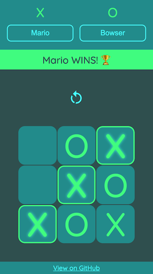

# odin-tic-tac-toe

**LIVE DEMO: https://olzcodes.github.io/odin-tic-tac-toe/**

The aim of this project was to create a basic game of Tic Tac Toe.

https://www.theodinproject.com/lessons/node-path-javascript-tic-tac-toe

## Screenshots

## What I learned from this project

- How to use factory functions and the module pattern to organise code.
- The importance of Separation of Concerns and how it helps manage complexity.
